## 🏆 Final Project ##
### Tutors: **Dr. Riva Shalom & Dr. Michal Chalamish**

Student name            | ID
| -------------         |-------------
| David Tal             | 204180269
| Lucas Kujawski        | 345535330
| Saar Pernik           |    308491265


ML Server
=====================================

________________
#### 🏁 Instructions ####
1. ```$ pip install -r requirements.txt```
2. ```$ ./deploy.sh```


### Diagram ###
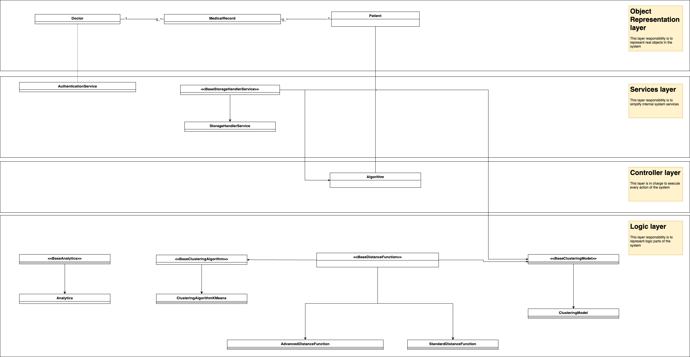

#### AdvancedDistanceFunction ####
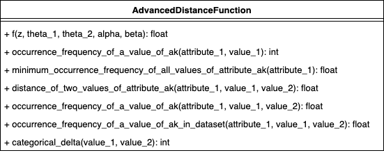
#### Algorithm ####
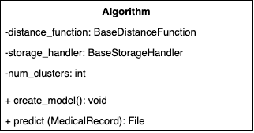
#### AuthenticationService ####
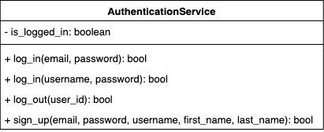
#### BaseAnalytics ####

#### BaseClusteringAlgorithm ####
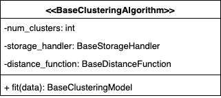
#### BaseClusteringModel ####
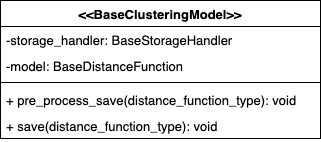
#### BaseDistanceFunction ####
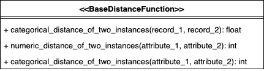
#### BaseStorageHandlerService ####
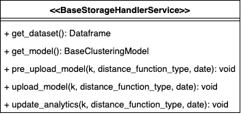
#### Doctor ####
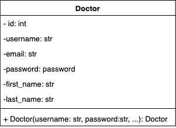
#### MedicalRecord ####
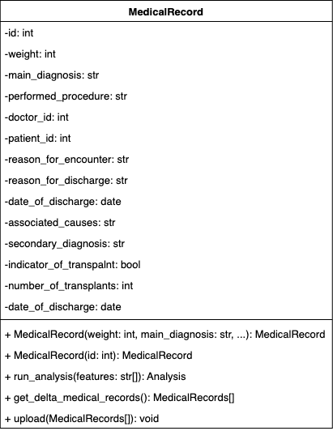
#### Patient ####
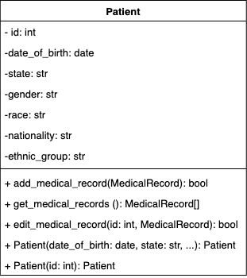
